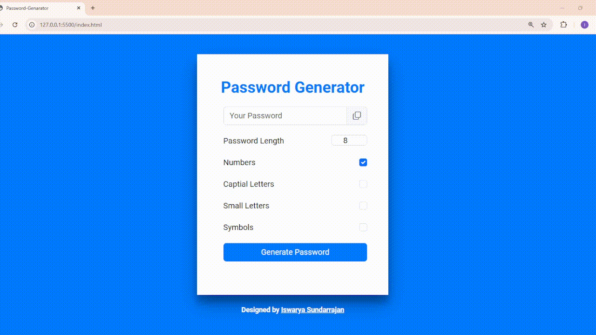

# 🔐 Password Generator

Easily create secure and customizable passwords with this **Password Generator!** Choose your desired length and character combinations to generate strong and reliable passwords.

## 🌟 Features

- ✨ **Customizable Options**: Choose to include numbers, uppercase letters, lowercase letters, and special symbols.
- 📏 **Password Length**: Adjustable length to meet your security needs.
- 🖱️ **Copy to Clipboard**: Easily copy the generated password with a single click.
- 🎨 **Responsive Design**: Fully responsive and user-friendly interface.

---

## 🎥 Preview

---

## 📸 Live Demo

👉 [View Live Project](https://iswarya-s26.github.io/Password-Generator/)

---

## 🛠️ Technologies Used

| **Technology**       | **Description**                          |
|-----------------------|------------------------------------------|
| HTML5                | For creating the basic structure         |
| CSS3 + Bootstrap 5   | For styling and responsive design        |
| JavaScript           | For password generation functionality    |

---

## 🚀 How to Use

1. 🔢 Set your desired **password length**.
2. ✅ Select the character types you want to include:
   - Numbers
   - Uppercase Letters
   - Lowercase Letters
   - Symbols
3. 🔄 Click the **Generate Password** button to create your password.
4. 📋 Use the **copy icon** to copy the password to your clipboard.

---

## 🧩 ASCII Reference Table

| **Range**   | **Characters**            |
|-------------|---------------------------|
| `65-90`     | Uppercase Letters (`A-Z`) |
| `97-122`    | Lowercase Letters (`a-z`) |
| `48-57`     | Numbers (`0-9`)           |
| Special     | `~!@#$%^&*()_+|}{<>*./`   |

---

## 📝 Author

👩‍💻 **Designed and Developed by [Iswarya Sundarrajan](https://www.linkedin.com/in/iswarya26/)**  
📫 Connect with me for more amazing projects!

---

